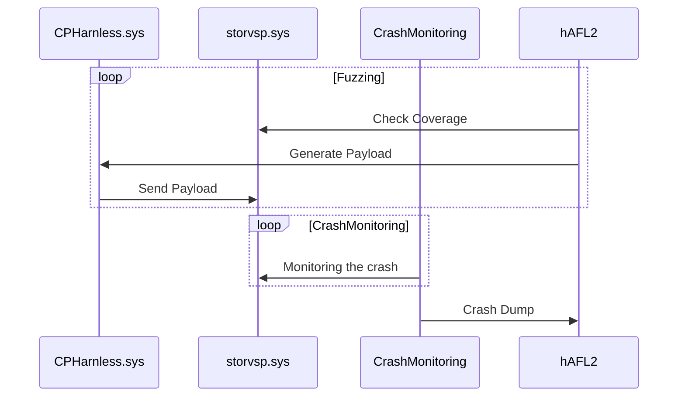

# 1. HVFUZZ
### 1-1) Summary
- Hyper-V Fuzzer using hAFL2
- This fuzzer was manufactured based on [hAFL2](https://github.com/SafeBreach-Labs/hAFL2), and [HyperViper](https://github.com/JaanusKaapPublic/HyperViper)'s technology is partially included. 
- Since the targets of these two fuzzers were different from my target, I developed a new fuzzer.
- Github Repository: [blackcon/HVFUZZ](https://github.com/blackcon/HVFUZZ)

### 1-2) Architecture (/source [hAFL2](https://github.com/SafeBreach-Labs/hAFL2))

### 1-3) Sequence Diagram

### 1-4) Reference
- [hAFL2](https://github.com/SafeBreach-Labs/hAFL2)
- [HyperViper](https://github.com/JaanusKaapPublic/HyperViper)

# 2. Modules
- CPHarness
    - Running on kernel of level2 
    - It only targets `storvsp/storvsc`. 
    - Send payload from guest to host
- packet_sender (In progress)
    - Running on user land of level2 
    - Send payload from user to kernel(CPHarness)

# 3. Appendix
   - [This](https://github.com/blackcon/HVFUZZ/issues/1) is that I recorded my shoveling journey for fuzzer setting.